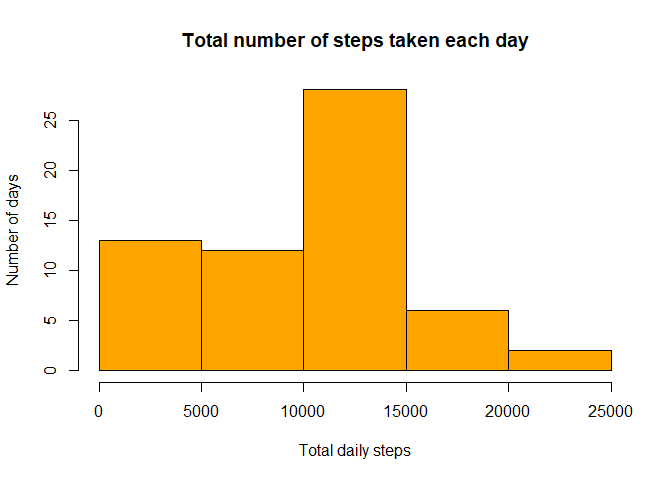
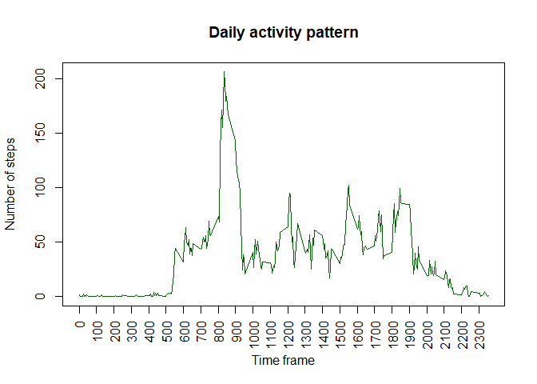
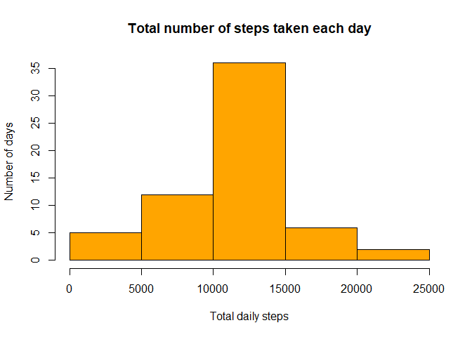

# Reproducible Research: Peer Assessment 1
Johns-Hopkins University - Coursera  
Marc Denis - Week 2 Course Project


## 0. Environment configuration

Let us begin by loading the required packages and configuring the parameters properly (working directory, display, etc.).


```r
library(knitr)
library(plyr)
library(dplyr)
```

```
## 
## Attaching package: 'dplyr'
```

```
## The following objects are masked from 'package:plyr':
## 
##     arrange, count, desc, failwith, id, mutate, rename, summarise,
##     summarize
```

```
## The following objects are masked from 'package:stats':
## 
##     filter, lag
```

```
## The following objects are masked from 'package:base':
## 
##     intersect, setdiff, setequal, union
```

```r
library(lattice)
library(grid)
opts_knit$set(root.dir='C:/Users/denis/OneDrive/Documents/Coursera/Course 5-2/RepData_PeerAssessment1')
opts_chunk$set(echo=TRUE)
```


## 1. Loading and preprocessing the data

### a. Load the data (i.e. read.csv())

The first step will consist in unzipping the data and read the file into a data frame.


```r
unzip("activity.zip")
activity<-read.csv("activity.csv")
```

### b. Process/transform the data (if necessary) into a format suitable for your analysis

Let us have a first look at the imported data.


```r
head(activity)
```

```
##   steps       date interval
## 1    NA 2012-10-01        0
## 2    NA 2012-10-01        5
## 3    NA 2012-10-01       10
## 4    NA 2012-10-01       15
## 5    NA 2012-10-01       20
## 6    NA 2012-10-01       25
```

```r
tail(activity)
```

```
##       steps       date interval
## 17563    NA 2012-11-30     2330
## 17564    NA 2012-11-30     2335
## 17565    NA 2012-11-30     2340
## 17566    NA 2012-11-30     2345
## 17567    NA 2012-11-30     2350
## 17568    NA 2012-11-30     2355
```

It seems that the column interval contains times.
The following code will create a column that will add zeroes in front of figures of the interval column,
in order to have times expressed on a 4-character HHMM format.


```r
activity<-mutate(activity,interval_hours=ifelse(interval<10,paste0('000',interval),ifelse(interval<100,paste0('00',interval),ifelse(interval<1000,paste0('0',interval),as.character(interval)))))
```

Let us preview the transformed data.


```r
head(activity)
```

```
##   steps       date interval interval_hours
## 1    NA 2012-10-01        0           0000
## 2    NA 2012-10-01        5           0005
## 3    NA 2012-10-01       10           0010
## 4    NA 2012-10-01       15           0015
## 5    NA 2012-10-01       20           0020
## 6    NA 2012-10-01       25           0025
```

```r
tail(activity)
```

```
##       steps       date interval interval_hours
## 17563    NA 2012-11-30     2330           2330
## 17564    NA 2012-11-30     2335           2335
## 17565    NA 2012-11-30     2340           2340
## 17566    NA 2012-11-30     2345           2345
## 17567    NA 2012-11-30     2350           2350
## 17568    NA 2012-11-30     2355           2355
```


## 2. What is mean total number of steps taken per day?

### a. Calculate the total number of steps taken per day

The **stepsperday** dataframe sums up the total number of steps taken each day.  
It thus contains as many rows as there are days, i.e. 61.  
The *daily_steps* column is equal to the sum of all the steps (ignoring NA values) taken by the subject during the corresponding day in the *date* column.


```r
stepsperday<-summarise(group_by(activity,date),daily_steps=sum(steps,na.rm=TRUE))
```

### b. Make a histogram of the total number of steps taken each day

A histogram shows the frequency of a quantitative variable in a data set. Here, the figure below consists in a histogram of the daily steps made by the subject, broken into five 5,000-unit wide intervals.


```r
hist(stepsperday$daily_steps, col='orange', xlab='Total daily steps', ylab='Number of days', main='Total number of steps taken each day')
```

<!-- -->

### c. Calculate and report the mean and median of the total number of steps taken per day


```r
mean_stepsperday<-mean(stepsperday$daily_steps, na.rm=TRUE)
median_stepsperday<-median(stepsperday$daily_steps, na.rm=TRUE)
mean_stepsperday
```

```
## [1] 9354.23
```

```r
median_stepsperday
```

```
## [1] 10395
```

On average during the observation period, the subject took 9354 steps. The median number of steps performed daily during the observation period is equal to 10395.

## 3. What is the average daily activity pattern?

### a. Make a time series plot (i.e. type = "l") of the 5-minute interval (x-axis) and the average number of steps taken, averaged across all days (y-axis)

The **stepsperinterval** dataframe sums up the average number of steps taken during each 5-minute interval.    
It thus contains as many rows as there are 5-minute intervals, i.e. 12x24 = 288.  
The *interval_steps* column is equal to the average, calculated accross the observation period, of all the steps (ignoring NA values) taken by the subject during the corresponding interval in the *interval* column.


```r
stepsperinterval<-summarise(group_by(activity,interval_hours),interval_steps=mean(steps,na.rm=TRUE))
```

Let us then prepare a time series plot to have a clearer view of the observed daily pattern.


```r
with(stepsperinterval,plot(x=interval_hours,y=interval_steps,type='l',main='Daily activity pattern',xlab='Time frame',ylab='Number of steps',col='darkgreen',xaxt='n'))
axis(1,at=seq(0,2300,by=100),las=2)
```

<!-- -->

### b. Which 5-minute interval, on average across all the days in the dataset, contains the maximum number of steps?

In order to answer this question, let us query the **stepsperinterval** dataframe and collect the *interval_hours* value that corresponds to the maximum value of the *interval_steps* column, i.e. the interval for which the average number of steps across the observation period is the highest.


```r
filter(stepsperinterval,interval_steps==max(interval_steps))
```

```
## # A tibble: 1 x 2
##   interval_hours interval_steps
##            <chr>          <dbl>
## 1           0835       206.1698
```

According to the result above and consistently with the data plotted on 3.a., the observed subject has performed the greatest number of steps on average between 08:35 and 08:39 (included) over the two-month period.

## 4. Imputing missing values

### a. Calculate and report the total number of missing values in the dataset (i.e. the total number of rows with NAs)


```r
count_nasteps<-count(activity,is.na(steps))
count_nasteps
```

```
## # A tibble: 2 x 2
##   `is.na(steps)`     n
##            <lgl> <int>
## 1          FALSE 15264
## 2           TRUE  2304
```

There are 2304 NA values in the dataset.

### b. Devise a strategy for filling in all of the missing values in the dataset. The strategy does not need to be sophisticated. For example, you could use the mean/median for that day, or the mean for that 5-minute interval, etc.

The strategy chosen here consists in filling in the missing values by using the mean for the 5-minute interval.  
For instance, if there is a missing value during a given day, at the 10:00 interval, then the average number of steps for that interval, observed over the 2-month period, will be populated.
Steps for filling in these values will be detailed in 4.c.

### c. Create a new dataset that is equal to the original dataset but with the missing data filled in.

First, the average number of steps per interval (column *interval_steps* of the **stepsperinterval** dataframe) will be added to the **activity** dataframe through a join operation using the *interval_hours* values as the key. A new dataframe, **activity_new** will be created as a result of the join operation.


```r
activity_new<-join(activity,stepsperinterval)
```

```
## Joining by: interval_hours
```

Then, the *steps_filled* column will be created on a conditional process: either the corresponding value in the *steps* column is already populated, then this value will be reported into the *steps_filled* column, either it is empty (NA), then the corresponding value in the *interval_steps* will be reported instead.


```r
#Creation of the new column
activity_new<-mutate(activity_new,steps_filled=ifelse(is.na(steps)==TRUE,interval_steps,steps))
#Drop the unnecessary column
activity_new<-select(activity_new,-interval_steps)
#Overview of the new data frame
str(activity_new)
```

```
## 'data.frame':	17568 obs. of  5 variables:
##  $ steps         : int  NA NA NA NA NA NA NA NA NA NA ...
##  $ date          : Factor w/ 61 levels "2012-10-01","2012-10-02",..: 1 1 1 1 1 1 1 1 1 1 ...
##  $ interval      : int  0 5 10 15 20 25 30 35 40 45 ...
##  $ interval_hours: chr  "0000" "0005" "0010" "0015" ...
##  $ steps_filled  : num  1.717 0.3396 0.1321 0.1509 0.0755 ...
```

```r
head(activity_new)
```

```
##   steps       date interval interval_hours steps_filled
## 1    NA 2012-10-01        0           0000    1.7169811
## 2    NA 2012-10-01        5           0005    0.3396226
## 3    NA 2012-10-01       10           0010    0.1320755
## 4    NA 2012-10-01       15           0015    0.1509434
## 5    NA 2012-10-01       20           0020    0.0754717
## 6    NA 2012-10-01       25           0025    2.0943396
```

Let us check that there is no NA values in the newly created column.


```r
count_nasteps_new<-count(activity_new,is.na(steps_filled))
count_nasteps_new
```

```
## # A tibble: 1 x 2
##   `is.na(steps_filled)`     n
##                   <lgl> <int>
## 1                 FALSE 17568
```

There is no NA value in the newly created column.

### d. Make a histogram of the total number of steps taken each day and Calculate and report the mean and median total number of steps taken per day. Do these values differ from the estimates from the first part of the assignment? What is the impact of imputing missing data on the estimates of the total daily number of steps?

The **stepsperday_new** dataframe sums up the total number of steps taken each day, including the former NA values that have been replaced earlier.  
The *daily_steps_new* column is equal to the sum of all the steps taken by the subject during the corresponding day in the *date* column.


```r
stepsperday_new<-summarise(group_by(activity_new,date),daily_steps_new=sum(steps_filled))
```

Here below is a histogram of the new daily steps values.


```r
hist(stepsperday_new$daily_steps_new, col='orange', xlab='Total daily steps', ylab='Number of days', main='Total number of steps taken each day')
```

<!-- -->

The mean and the median values are also recomputed.


```r
mean_stepsperday_new<-mean(stepsperday_new$daily_steps_new)
median_stepsperday_new<-median(stepsperday_new$daily_steps_new)
mean_stepsperday_new
```

```
## [1] 10766.19
```

```r
median_stepsperday_new
```

```
## [1] 10766.19
```

During the observation period, and if NA values have been filled with the average value observed during the corresponding interval, then on average the subject took 1.0766189\times 10^{4} steps. The new median number of steps performed is equal to 1.0766189\times 10^{4}.  

**Note to peer reviewers:** scientific notation has been automatically used here due to R internal settings displaying inline results with the scientific notation if the number to be displayed exceeds a certain threshold. Please refer to the results above for a classic decimal notation.


These values differ from those seen in the part 2 of the assignment. Both the mean and the median are higher (and, incidentally, are both equal to each other), and the histogram is more centered around the mean, which is to be expected since the NA values have been replaced by average observed values.
Imputing missing data has changed the estimates and influenced their values. The average has increased, which means that many intervals lacking observations were intervals with a higher-than-average activity.

Here is a comparison between initial values and newly filled values:

```r
summary(stepsperday$daily_steps)
```

```
##    Min. 1st Qu.  Median    Mean 3rd Qu.    Max. 
##       0    6778   10395    9354   12811   21194
```

```r
summary(stepsperday_new$daily_steps_new)
```

```
##    Min. 1st Qu.  Median    Mean 3rd Qu.    Max. 
##      41    9819   10766   10766   12811   21194
```


## 5. Are there differences in activity patterns between weekdays and weekends?

### a. Create a new factor variable in the dataset with two levels - "weekday" and "weekend" indicating whether a given date is a weekday or weekend day.

A new column is created in the **activity_new** dataframe. This factor column *week_status* takes 2 possible values: weekend if the corresponding day is a Saturday (French locale settings: "samedi") or a Sunday (French locale settings: "dimanche"), weekday in the other cases.


```r
activity_new<-mutate(activity_new,week_status=as.factor(ifelse(weekdays(as.Date(date)) %in% c('samedi','dimanche'),'weekend','weekday')))
```

### b. Make a panel plot containing a time series plot (i.e. type = "l") of the 5-minute interval (x-axis) and the average number of steps taken, averaged across all weekday days or weekend days (y-axis). See the README file in the GitHub repository to see an example of what this plot should look like using simulated data.

The **stepsperinterval_new** dataframe sums up the average number of steps taken during each 5-minute interval, taking into account the fact that this is a weekday or not.    
It thus contains as many rows as there are 5-minute intervals, times 2 factors (weekday/weekend), i.e. 12x24x2 = 576.  
The *interval_steps_new* column is equal to the average, calculated accross the observation period, of all the steps taken by the subject during the corresponding interval in the *interval* column, broken down by weekday or weekend.


```r
stepsperinterval_new<-summarise(group_by(activity_new,interval_hours,week_status),interval_steps_new=mean(steps_filled))
```

The plot below represents the average number of steps per 5-minute interval, in two different panels (depending on if the steps have been made during a weekend or not).


```r
xyplot(interval_steps_new~as.integer(interval_hours) | week_status, data=stepsperinterval_new, layout=c(1,2), type='l', col='darkgreen', xlab='Time frame', ylab='Number of steps', main='Daily pattern - Weekend vs. Weekday')
```

<!-- -->

There is a difference in the daily activity pattern according to the day of the week. During weekdays, the activity begins earlier than during the weekend on average, and spikes in the morning, while the overall daily activity is smoothed over the whole day during weekends.
The number of steps seems also higher during the weekends than during weekdays.
